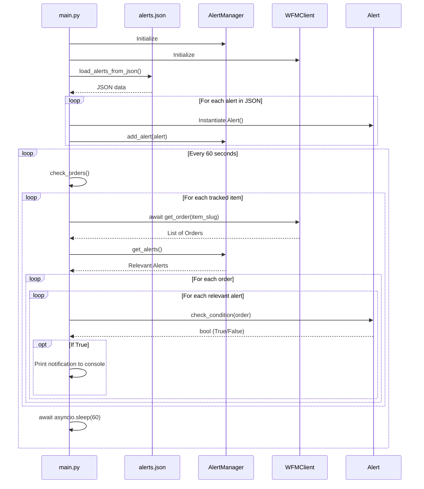

# Warframe Market Checker

## Overview
The Warframe Market Checker is an asynchronous Python application that continuously monitors the Warframe Market API for specific item listings. It helps users snipe items by instantly notifying them when a seller lists a desired item at or below a target price.

## How It Works

1. **Configuration**: 
   Alerts are configured in a local `alerts.json` file. Each alert specifies an `item_slug` (the item's unique identifier on the market), a `max_price` (maximum platinum the user is willing to spend), and an optional minimum `rank`.

2. **Monitoring**:
   The `main.py` script runs an asynchronous loop using `asyncio` and `httpx`. Every 60 seconds, it fetches the latest orders for all tracked items.

3. **Filtering & Evaluation**:
   Orders are passed to the `Alert` class (`wfm/alert.py`), which filters out invalid listings. An alert is only triggered if:
   - The listing is a **sell** order.
   - The seller's status is strictly **ingame**.
   - The listing price is **less than or equal to** the alert's maximum price.
   - The item meets the minimum **rank** requirement (if specified).

4. **Notification**:
   When an order satisfies all criteria, the application outputs the seller's in-game name, the listing price, and the item's rank to the console, allowing the user to quickly copy and paste a buy message in-game.

## Call Sequence
Below is a sequence diagram illustrating the lifecycle of the application and the interactions between its components.

## Architecture Components
* `main.py`: The core orchestrator managing the event loop, API requests, and standard output.
* `wfm/alert.py`: Contains the `Alert` data class and the business logic for matching orders to alert criteria.
* `wfm/alert_manager.py` *(implicit)*: Manages the collection of active alerts in memory.
* `wfm.WFMClient` *(implicit)*: Handles external HTTP communication with the Warframe Market API.
* `wfm.models.Order` *(implicit)*: The data model representing an individual market listing.

## Dependencies
- `httpx`: For asynchronous HTTP requests.
- `asyncio`: For managing the continuous checking loop without blocking execution.